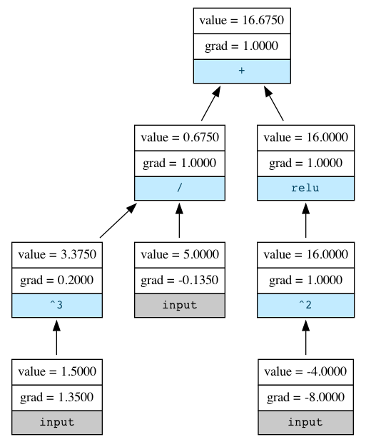

# autograd-for-dummies


A minimal autograd engine written from scratch using no libraries. Inspired heavily by Andrej Karpathy's [micrograd](https://github.com/karpathy/micrograd), but has lots of comments explaining the math, concepts etc. along the way.

## Overview

Create a `Scalar`.

```python
a = Scalar(1.5)
```

Do some calculations.

```python
b = Scalar(-4.0)
c = a**3 / 5
d = c + (b**2).relu()
```

Compute the gradients via [reverse-mode automatic differentiation](https://en.wikipedia.org/wiki/Automatic_differentiation#Reverse_accumulation).

```python
d.backward()
```

Display the computational graph with graphviz.

```python
draw_graph(d)
```




