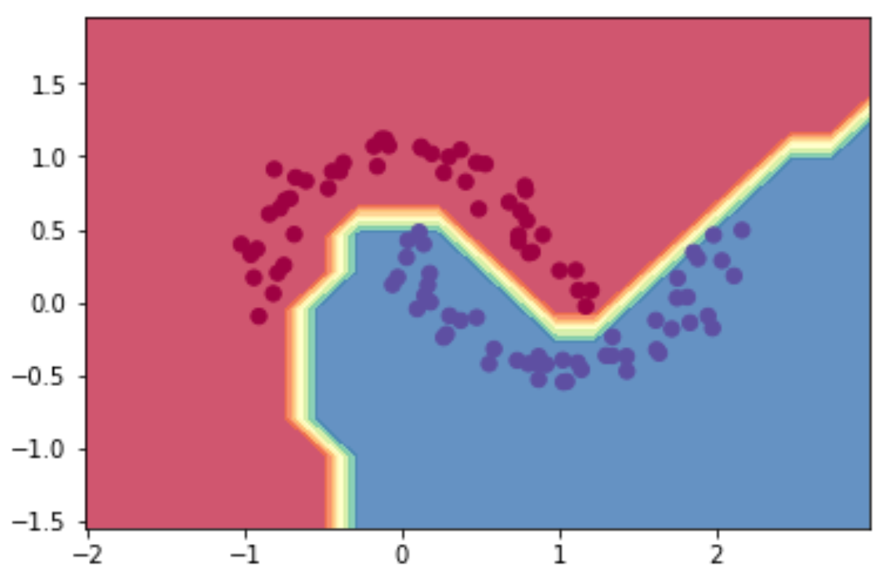

# autograd-for-dummies


A minimal autograd engine and neural network library written from scratch. Inspired heavily by Andrej Karpathy's [micrograd](https://github.com/karpathy/micrograd), but has lots of comments explaining the math, concepts etc. along the way.

## Autograd Engine

`autograd.engine` module implements a scalar valued autograd engine, which tracks values, their gradients,
and the executed operations (and the resulting new values) in the form of a DAG (directed acyclical graph).


In this DAG the leaves are the input values and the roots are the outputs of the computational graph. 


By tracing this graph from root to leaves, you can calculate the gradient of each node by using the [chain rule](https://en.wikipedia.org/wiki/Chain_rule).


This is called backpropagation, or more formally, [reverse-mode automatic differentiation](https://en.wikipedia.org/wiki/Automatic_differentiation#Reverse_accumulation).


### Example with Computational Graph

Create a `Scalar`.

```python
a = Scalar(1.5)
```

Do some calculations.

```python
b = Scalar(-4.0)
c = a**3 / 5
d = c + (b**2).relu()
```

Compute the gradients via [reverse-mode automatic differentiation](https://en.wikipedia.org/wiki/Automatic_differentiation#Reverse_accumulation).

```python
d.backward()
```

Display the computational graph with graphviz.

```python
draw_graph(d)
```


## Neural Network Library

### Example: Simple Neural Network (Feed-Forward Multilayer Perceptron)

`autograd.nn` contains a simple neural network library, which contains building blocks for simple neural nets
such as neurons, layers, and even a MLP (multi-layer perceptron).

`autograd.utils` contains some important utilities such as common loss functions, regularization techniques, and more.

(specifically a feed forward MLP) binary classifier, and achieve 100% accuracy
on the classic moon dataset.

The notebook `demo_nn.ipynb` demonstrates how to use the neural network library to build and train a simple
neural net (specifically a feed forward MLP) binary classifier, and achieve 100% accuracy
on the classic moon dataset.



